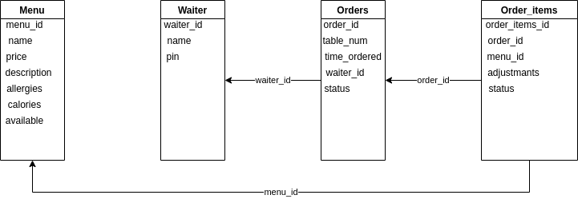

## Database structure

#### Structure
Table Menu holds the different items served by the restaurant.

Table Waiter holds the waiters in the restaurant.

Table Orders holds the orders made by customers.

Table Order_items holds the individual items in an order.

#### Keys
menu_id is the primary key of the menu table. It is referenced by Order_items to know what item has been ordered

order_id is the primary key of the Orders table. It is referenced by Order_items to know part of what order the item is

waiter_id is the primary key of the Waiter table. 
It is referenced by Order to know what waiter is responsible for the order